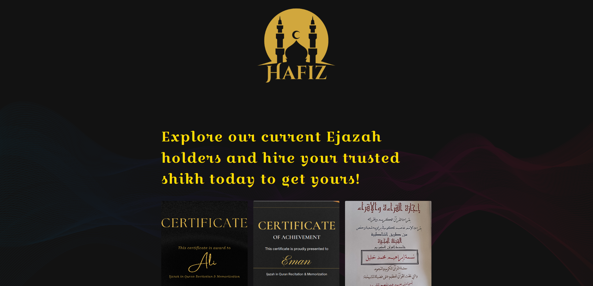

# Hafiz : Preserving the holy Quran and it's recitation for the next generations.
-------------------------

## Intro :
This intro is for readers who are not familiar with Islamic civilization. 
### A chain of transmission (sanad)
Since the early days of Isalm, Isalm scholars adopted sanad methodology (a chain of transmission (sanad)) to authenticate Isalmic knowlege. It stands as one of the primary safeguards against any potential alterations or errors in this sacred knowledge.
### Ejazah/Ijazah
#### Why?
In Islam, the Quran represents the divine speech of Allah (SWT), revealed to the final prophet, Muhammad (PBUH). Consequently, any errors in its recitation are considered a grave sin. When the Quran is conveyed by individuals who have not mastered it, it can perpetuate a chain of inaccuracies that ultimately trace back to the initial transgressor who dared to transmit it incorrectly. Thus, obtaining  Ijazah is required for any Quran teacher/scholar.
#### What?
An ijazahis a license authorizing its holder to transmit a certain text or subject, which is issued by someone already possessing such authority. It is particularly associated with transmission of Islamic religious knowledge. To guarantee its authenticity and faithful transmission, a system of certification known as "ijazah" has been firmly established from the earliest periods of Islamic history and civilization. You can think about Ejzah/Ijazah as deploma that is granted to Quran students who memorize the Quran perfectly and can recite the whole Quran by heart (without reading from the holy Quran book) without any mistake in front of an Ijazah certified Sheikh or Quran Teacher and uthorizes its holder to teach Quran Memorization (Hifz). Ijazah only can be awarded by an already certified Imam or scholar. it authorizes its holder to teach Quran Memorization (Hifz). 
This process is called Sanad, Ijazah/Sanad played a critical role in transmitting Quran & Islamic knowledge across the ages. It’s one of the major factors that preserved Islamic knowledge from any manipulation or mistakes.


### About Hafiz 
 Hafiz is a platform for Quran students and teachers where they can :
 - Quran students can find certified teachers to teach them Quran Memorization (Hifz) and then get Ijazah.
 - Quran teachers can find students to teach them Quran with competitive prices so they can get sustainable income.
 - Quran teachers can meet other teachers and share their knowledge and experience.
 - New muslims can find trusted teachers to teach them Quran which is essential for any muslim as they recite Quran in their daily prayers. (5 times a day)especially in non-muslim countries where they don't have access to mosques or Islamic centers.
## Problem:
- Quran students don't have access to certified teachers to teach them Quran Memorization (Hifz) and then get Ijazah.
- Some malicious people claim that they are certified teachers and they can give Ijazah to Quran students without any certification. This is a big problem as it can lead to mistakes in Quran recitation and this is a grave sin in Islam. They do this to get money from students, to get jobs in Islamic centers or mosques or to get fame.
- Quran teachers don't have access to students to teach them Quran with competitive prices so they can get sustainable income.
## Features
-  On Chain Ijazah:
   -   Issue Ijazah on chain so it can't be manipulated or forged. Each Ijazah is linked to the teacher who issued it and the student who got it. This will help to prevent any manipulation or forgery.
   -  Issued Ijazah can be verified by anyone to make sure that it is issued by a certified teacher.
   -  Issued Ijazah can not be revoked by the teacher who issued it or transferred to another student.
   -  Issued Ijazah should be in the same Recitation style (Qira'at) as the teacher who issued it.
- Hafiz DAO : Data DAO
  - Hafiz DAO is a data DAO for Ijazah holders where they can use the dao to issue Ijazah and store it on chain. The DAO will refund the members with the fees that they paid to issue Ijazah.
  - To give extra layer of security:
    -  the DAO will be controlled by a multi-sig wallet where the members of the DAO will be the signers of the wallet.
    -  issuing new Ijazah will be done in optimistic way  where the issuer will propose the Ijazah. If no member of the DAO object `flag` to the Ijazah within a period of time, the Ijazah will be issued and members will be refunded with the  storage fees that they paid to issue Ijazah.
    -  Flagging an Ijazah will be done by sending a transaction to the DAO contract with the proposal id. 
    -  Flagged Proposals will be terminated by the DAO contract and the issuer will be refunded with the storage fees that he paid to issue Ijazah. " Later we will improve the governance of the DAO to make it more decentralized and secure"
    -  DAO members only needs to send the CID ,  Recitation style (Qira'at) and the student address  ass well as their Ijazah (parent chain id) to the DAO to issue Ijazah. The DAO will call lighthouse contract onchain to start lighthouse job. Later Hafiz will run Hafiz Aggregation service.
 -  Marketplace:
    -  Student can send on-chain offers to teachers after negotiation off-chain. student sends the fees in crypto stored in the contract.
    -  Teacher can accept or reject the offer on chain within timeframe and  student gets refunded.
    -  Student or teacher can cancel an offer within a timeframe and  student gets refunded 
    -  When the offer is accepted and job is completed, teacher will call the contract to get the money and  make the offer as fullfilled.
    - For each successful completion of the offer, **3% of fees** will be charged and sent to the **DAO** to be used for storing DAO members Data.
 - Students can explore a list of  certified teachers and they can personally contact them to teach them Quran Memorization (Hifz) and then get Ijazah.
 - Students can check the Ijazah of the teacher to make sure that he is certified. They can do this by checking the chain of transmission (sanad) of the teacher.
 
## Tech Stack
- Hafiz is built on top of Filecoin and lightouse.
- Hafiz is built using React, Next.js, Solidity, Hardhat, Ethers.js, Tailwindcss, and web3.js.
## Target User
More than 1.9 billion muslims around the world who:
- Recite Quran in their daily prayers (5 times a day)
-  Very keen to recite it perfectly
-  Very keen to teach their children Quran
-   Many of them are scholars and they have Ijazah in Quran to complete their studies or to work in Islamic centers or mosques.
## How to run
  The project consists of 3 parts:
    -  Frontend: 
       -  `cd app`
       -  run `yarn dev`
    -  Smart Contracts: 
       -  Due to an issue with foundry script with filecoin , I had to move the smart contracts to hardhat project. you can use foundry or hardhat to deploy the contracts. ([check it here](https://github.com/filecoin-project/filecoin-solidity/issues/17#issuecomment-1735977949))
    -  Lighthouse: 
       -  you need to run the lighthouse server to run the aggregation service.
       -  when user submits the Ijazah to the DAO, the DAO will call the lighthouse contract to start the lighthouse job.
    
  ``` bash
        cd back-end/raas-starter-kit
        yarn install
        yarn run service 
 ```
        
        
## How it is aligned with Filecoin vision and web3 ecosystem
- Filecoin plus,increasing Filecoin’s effectiveness at becoming the decentralized storage network for humanity’s most important information. Quran is the most important information for muslims. It is the divine speech of Allah (SWT), revealed to the final prophet, Muhammad (PBUH). Storing Ijazah, it's proofs and Quran recitation on Filecoin will help to preserve  the holy Quran and it's recitation for the next generations. Also creating a marketplace for Quran teachers and students will keep the process sustainable.
-  Issue Ijazah on chain so it can't be manipulated or forged. Each Ijazah is linked to the teacher who issued it and the student who got it. This will help to prevent any manipulation or forgery.
## Architecture / lifecycle
- Over 1400 years, so many Ijazahs were issued and stored in different places. Some of them were lost or manipulated. Since we are not inventing a new process, we are just digitizing the current process, we will start by migrating the old/legacy ones chain. This is done with admin previliges.
- Any Ijazah holder can join the DAO. and only then he can `propose` a new Ijazah. The DAO will refund the members with the fees that they paid to store Ijazah proofs on filecoin.
  - For any successful proposal, any DAO member can execute the proposal and the Ijazah will be stored on chain. the `client` will be refunded with the fees that he paid to store the Ijazah Proofs on chain. 
- Marketplace is accessible for everyone. Students can send on-chain offers to teachers after negotiation off-chain. Teacher must hold Ijazah to be able to accept the offer. 
- Once the students is able to memorize the Quran perfectly and can recite the whole Quran by heart (without reading from the holy Quran book) without any mistake in front of an Ijazah certified Sheikh or Quran Teacher. His teacher can send a proposal to the DAO to issue Ijazah. if no one flags the proposal within a period of time, the Ijazah will be issued and he can join the DAO, teach other via the marketplace or anywhere else and  issue Ijazahs.

## What's stored on filechain ?
- Ijazahs proofs : Recording of the student reciting the whole Quran in front of the teacher.
- Ijaazahs certificate : cerifcate style of the Ijazah **NFT**
- contracts : we are using FVM so all the contracts are deployed on filecoin chain.
## Future work
- support renewing the storage service Ijazahs proofs and Ijazahs certificate . 
- create p2p classes where students can join the class and the teacher can teach them Quran.
- streaming the Ijazahs proofs directly instead of storing them and uploading the recording to filecoin.
- improve the current logic, security and governance of the DAO and the marketplace.
- improve the current UI/UX.
- 
## Bountis 


